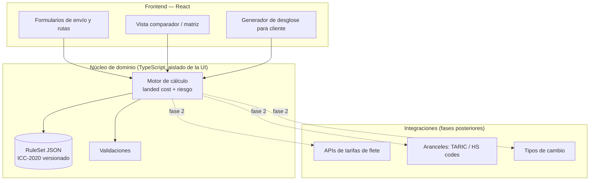

# Comparador de Incoterms para Transitarios — Documento de Diseño Técnico

> **Estado:** borrador v0.1 · **Fecha:** 2026-08-23 · **Autor:** Jorge (con asistencia de Claude)
> **Base normativa:** Incoterms® 2020 (ICC), 11 reglas. Motor preparado para versionar reglas futuras.

---

## 1. Objetivo

Construir una aplicación web que ayude al **transitario** a decidir y asesorar sobre **qué opción de entrega conviene más** a su cliente, cruzando tres variables:

1. **Precio** — coste total puesto en destino (*landed cost*) de cada escenario.
2. **País** — ruta origen→destino, con sus aranceles, impuestos y particularidades.
3. **Condiciones Incoterm** — reparto de obligaciones, costes y **punto de transferencia del riesgo** según cada una de las 11 reglas.

La herramienta no sustituye el criterio del transitario: lo **acelera y lo documenta**. Toma unos costes por segmento y una ruta, y devuelve una tabla comparativa clara con quién paga qué, cuánto cuesta cada opción y dónde se transfiere el riesgo.

### 1.0 Principio de diseño: accesible para quien domina poco los Incoterms

Un objetivo **central** —no secundario— es que la app sea útil para usuarios que conocen poco o tienen dificultades con los Incoterms (transitarios junior, personal administrativo, exportadores noveles). Esto condiciona todo el diseño de la interfaz:

- **Modo guiado (asistente)** que hace preguntas en lenguaje llano y **recomienda** el Incoterm adecuado, en lugar de exigir que el usuario ya sepa cuál elegir (ver §7.5).
- **Lenguaje sin jerga** con la terminología técnica siempre acompañada de su explicación (tooltips, glosario integrado).
- **Explicación visual** de quién paga cada tramo y dónde pasa el riesgo, en vez de solo tablas.
- **Avisos y "trampas comunes"** — por ejemplo, el desfase coste↔riesgo del grupo C (CPT/CIP/CFR/CIF), que confunde incluso a profesionales.
- Doble nivel de lectura: una vista **simple** por defecto y una vista **experta** con todo el detalle.

### 1.1 Aclaración normativa importante

Las reglas **oficialmente en vigor** de la ICC son las **Incoterms® 2020** (11 reglas). La ICC las revisa aproximadamente cada 10 años, por lo que la siguiente revisión oficial se espera hacia ~2030. El contenido que circula como "Incoterms 2026" en la web es material interpretativo/comercial, **no una versión oficial**. Por eso:

- El **motor de reglas** se construye sobre las 11 reglas 2020 como fuente autoritativa.
- Las reglas se almacenan como **datos versionados** (un fichero JSON con `version: "ICC-2020"`), de modo que una futura versión oficial se cargue como un nuevo conjunto de datos **sin tocar el código**.

---

## 2. Usuarios y casos de uso

**Usuarios:**

- **Transitario / agente de carga** (usuario avanzado): prepara ofertas y asesora a exportadores e importadores. Quiere rapidez y detalle.
- **Usuario con poco dominio de Incoterms** (perfil prioritario en diseño): transitario junior, personal administrativo, exportador novel. Necesita que la app le **guíe y le explique**, no que presuponga conocimiento.

**Casos de uso clave:**

- **CU-0 — Recomendar un Incoterm (modo guiado).** El usuario responde preguntas sencillas (¿quién quiere controlar el transporte?, ¿hasta dónde quieres responsabilizarte?, ¿modo de transporte?) y la app **sugiere** el/los Incoterms adecuados y los explica. *(Función estrella para el perfil novel.)*
- **CU-1 — Comparar Incoterms para un mismo envío.** Mismo envío y costes; ver cómo cambia el reparto vendedor/comprador y el coste según EXW, FOB, CIF, DAP, DDP, etc.
- **CU-2 — Comparar rutas/países.** Mismo Incoterm, distintas rutas o países de destino (aranceles e impuestos distintos), para ver dónde sale mejor.
- **CU-3 — Comparador completo (matriz).** Cruzar **Incoterms × rutas** en una sola tabla y rankear por coste total y por criterio de riesgo. *(Alcance del MVP.)*
- **CU-4 — Aprender / explicar.** Ver en lenguaje llano y de forma visual quién paga qué y dónde pasa el riesgo de cada Incoterm; generar un desglose legible para adjuntar a una oferta o para formarse.
- **CU-5 (fase 2) — Trazabilidad.** Registrar de forma inmutable la oferta/acuerdo aceptado entre las partes.

---

## 3. Dominio: la cadena de costes

Todo envío internacional se descompone en una **cadena de segmentos de coste**. La app trabaja con esta cadena canónica de 11 segmentos:

| # | Segmento | Descripción |
|---|----------|-------------|
| S1 | Embalaje y verificación | Embalaje de exportación, marcado, comprobación de calidad/medida. |
| S2 | Carga en origen | Carga de la mercancía en el vehículo en las instalaciones del vendedor. |
| S3 | Transporte interior origen (*pre-carriage*) | Del vendedor a la terminal/puerto/aeropuerto de salida. |
| S4 | Despacho de exportación | Formalidades y costes aduaneros de exportación, licencias. |
| S5 | Manipulación terminal origen (THC origen / carga a bordo) | Handling en terminal de salida y, en marítimo, carga al buque. |
| S6 | Flete principal (*main carriage*) | Transporte internacional principal (marítimo, aéreo, terrestre). |
| S7 | Seguro | Seguro de la mercancía durante el transporte principal. |
| S8 | Manipulación terminal destino (THC destino) | Descarga del medio principal y handling en terminal de llegada. |
| S9 | Despacho de importación + aranceles + impuestos | Formalidades de importación, derechos arancelarios, IVA/impuestos. |
| S10 | Transporte interior destino (*on-carriage*) | De la terminal de llegada al lugar final acordado. |
| S11 | Descarga en destino final | Descarga de la mercancía en el punto de entrega final. |

> **Nota sobre S7 (seguro):** solo **CIF** y **CIP** obligan al vendedor a **contratar** el seguro. En el resto de reglas el seguro es opcional y lo asume quien soporta el riesgo en cada tramo. En 2020, **CIP exige cobertura amplia** (Institute Cargo Clauses **A**) y **CIF cobertura mínima** (ICC **C**) — diferencia introducida en la revisión 2020.

---

## 4. Las 11 reglas Incoterms® 2020

### 4.1 Agrupación por modo de transporte

- **Cualquier modo o modos de transporte:** EXW, FCA, CPT, CIP, DAP, DPU, DDP.
- **Solo transporte marítimo y por vías navegables interiores:** FAS, FOB, CFR, CIF.

### 4.2 Matriz de asignación de costes (quién paga cada segmento)

Leyenda: **V** = coste del **vendedor**, **C** = coste del **comprador**.
(El seguro S7 se marca V solo cuando la regla **obliga** a contratarlo; en el resto es opcional según riesgo → "—".)

| Regla | S1 Embalaje | S2 Carga orig. | S3 Interior orig. | S4 Desp. export. | S5 THC orig. | S6 Flete | S7 Seguro | S8 THC dest. | S9 Import.+aranc. | S10 Interior dest. | S11 Descarga final | Modo |
|-------|:--:|:--:|:--:|:--:|:--:|:--:|:--:|:--:|:--:|:--:|:--:|:--|
| **EXW** | V | C | C | C | C | C | — | C | C | C | C | Cualquiera |
| **FCA** | V | V\* | V | V | C | C | — | C | C | C | C | Cualquiera |
| **FAS** | V | V | V | V | C | C | — | C | C | C | C | Marítimo |
| **FOB** | V | V | V | V | V | C | — | C | C | C | C | Marítimo |
| **CFR** | V | V | V | V | V | V | — | C | C | C | C | Marítimo |
| **CIF** | V | V | V | V | V | V | **V** (ICC C) | C | C | C | C | Marítimo |
| **CPT** | V | V | V | V | V | V | — | C | C | C | C | Cualquiera |
| **CIP** | V | V | V | V | V | V | **V** (ICC A) | C | C | C | C | Cualquiera |
| **DAP** | V | V | V | V | V | V | — | V | C | V | C | Cualquiera |
| **DPU** | V | V | V | V | V | V | — | V | C | V | **V** | Cualquiera |
| **DDP** | V | V | V | V | V | V | — | V | **V** | V | C | Cualquiera |

\* **FCA S2:** si la entrega es en las instalaciones del vendedor, el vendedor carga (V). Si es en otro lugar designado, el vendedor entrega la mercancía preparada para descargar sobre su medio de transporte y la descarga corre por cuenta del comprador. La app modela esta variante con un parámetro `fca_delivery_point`.

> **Matices de "coste de carga/flete" (CPT/CIP/CFR/CIF):** el vendedor **paga el flete hasta destino**, pero el **riesgo se transfiere antes** (ver 4.3). Los gastos de descarga en destino (S8) corren por cuenta del comprador **salvo** que estuvieran incluidos en el flete contratado por el vendedor. La app permite marcar S8 como "incluido en flete" para estos casos.

### 4.3 Punto de transferencia del riesgo

El **riesgo** (pérdida o daño de la mercancía) se transfiere en un punto que **no siempre coincide** con el reparto de costes — la diferencia es clave para asesorar al cliente.

| Regla | El riesgo se transfiere… |
|-------|--------------------------|
| **EXW** | En las instalaciones del vendedor, al poner la mercancía a disposición (sin cargar). |
| **FCA** | Al entregar la mercancía al transportista designado por el comprador (o cargada, si es en instalaciones del vendedor). |
| **FAS** | Cuando la mercancía se coloca **al costado del buque** en el puerto de embarque. |
| **FOB** | Cuando la mercancía está **a bordo del buque** en el puerto de embarque. |
| **CFR** | Cuando la mercancía está **a bordo del buque** en origen (aunque el flete se pague hasta destino). |
| **CIF** | Cuando la mercancía está **a bordo del buque** en origen (flete y seguro pagados hasta destino). |
| **CPT** | Al entregar al **primer transportista** en origen (aunque el porte se pague hasta destino). |
| **CIP** | Al entregar al **primer transportista** en origen (porte y seguro pagados hasta destino). |
| **DAP** | En el **lugar de destino** designado, con la mercancía lista para descargar (sin descargar). |
| **DPU** | En el **lugar de destino** designado, una vez **descargada**. |
| **DDP** | En el **lugar de destino** designado, lista para descargar (despacho de importación pagado). |

> **"Grupo C" (CPT/CIP/CFR/CIF) — el gran malentendido:** son los únicos donde el punto de coste (destino) y el punto de riesgo (origen) están **separados**. La app resalta visualmente este desfase, porque es la fuente más habitual de conflictos con el cliente.

---

## 5. Modelo de datos

### 5.1 Entidades principales

```
RuleSet            # conjunto de reglas versionado (p. ej. "ICC-2020")
 └─ Rule           # una de las 11 reglas: code, mode, allocations[S1..S11], riskTransfer, notes
    └─ Allocation  # por segmento: payer (SELLER|BUYER), mandatory, conditions

Shipment           # el envío a analizar
 ├─ goods          # descripción, valor, peso, volumen, HS code
 ├─ origin         # país, ciudad, tipo de punto (premises|terminal|port)
 └─ destination    # país, ciudad, tipo de punto

Route              # una ruta concreta origen→destino
 ├─ segments[]     # coste estimado por cada segmento S1..S11
 ├─ dutyRate       # % arancel (según HS code y país destino)
 ├─ taxRate        # % IVA/impuestos destino
 └─ currency

Scenario           # combinación evaluable = Route × Rule
 └─ result         # sellerCost, buyerCost, totalLandedCost, riskPoint, breakdown[]

Comparison         # conjunto de Scenarios rankeados por coste y por criterio de riesgo
```

### 5.2 Ejemplo del JSON de reglas (extracto)

```json
{
  "version": "ICC-2020",
  "source": "ICC Incoterms 2020",
  "rules": [
    {
      "code": "CIF",
      "name": "Cost, Insurance and Freight",
      "mode": "SEA",
      "riskTransfer": "ON_BOARD_ORIGIN",
      "allocations": {
        "S1": { "payer": "SELLER" },
        "S2": { "payer": "SELLER" },
        "S3": { "payer": "SELLER" },
        "S4": { "payer": "SELLER" },
        "S5": { "payer": "SELLER" },
        "S6": { "payer": "SELLER" },
        "S7": { "payer": "SELLER", "mandatory": true, "cover": "ICC_C" },
        "S8": { "payer": "BUYER", "conditions": ["unless_included_in_freight"] },
        "S9": { "payer": "BUYER" },
        "S10": { "payer": "BUYER" },
        "S11": { "payer": "BUYER" }
      }
    }
  ]
}
```

Modelar las reglas como **datos** (no como `if/else` en el código) es la decisión de arquitectura más importante: permite auditar la lógica, versionar la normativa y que un experto la revise sin leer código.

---

## 6. Motor de cálculo

### 6.1 Cálculo de un escenario (Route × Rule)

Para cada segmento S1..S11 con coste `cost[Si]` y pagador `payer[Si]` según la regla:

```
sellerCost = Σ cost[Si]  para todo Si con payer = SELLER
buyerCost  = Σ cost[Si]  para todo Si con payer = BUYER
```

**Aranceles e impuestos (S9)** se calculan sobre la base imponible correspondiente:

```
baseArancel   = valorMercancia + (costes hasta frontera según Incoterm, si aplica CIF-value)
arancel       = baseArancel × dutyRate
baseImpuestos = baseArancel + arancel
impuestos     = baseImpuestos × taxRate      # IVA a la importación
costeS9       = despachoImportacion + arancel + impuestos
```

> La base del arancel suele ser el **valor CIF** en muchos países (valor mercancía + flete + seguro hasta frontera). La app parametriza `dutyBase = CIF | FOB | CUSTOM` por país, porque **varía según jurisdicción**.

```
totalLandedCost = sellerCost + buyerCost         # coste total de la operación
riskPoint       = rule.riskTransfer              # etiqueta del punto de riesgo
```

### 6.2 Comparador (CU-3)

Dada una lista de `Route[]` y una selección de `Rule[]`, se genera la matriz de `Scenario[]` y se ordena por:

1. **Coste total** (asc.).
2. **Coste para la parte de interés** (vendedor o comprador, según quién asesore el transitario).
3. **Criterio de riesgo** (p. ej. penalizar reglas del grupo C donde riesgo y coste se separan).

La salida incluye, por escenario: coste vendedor, coste comprador, total, punto de riesgo y desglose segmento a segmento, más un **ranking** y avisos (p. ej. "regla marítima usada en envío aéreo → no válida").

### 6.3 Validaciones

- Reglas marítimas (FAS/FOB/CFR/CIF) **solo** con modo de transporte marítimo → aviso si no.
- Coincidencia de moneda / conversión con tasa de cambio.
- Segmentos sin coste informado → marcar como estimación pendiente, no como 0.

---

## 7. Arquitectura de la aplicación

### 7.1 Visión general



**Principio rector (diseño de software):** el **núcleo de dominio** (reglas + motor de cálculo) es una librería TypeScript **pura, sin dependencias de React ni de red**. La UI y las integraciones se conectan a él, nunca al revés. Esto hace el motor testeable al 100 % con datos de ejemplo y reutilizable (web, futura API, futura app móvil).

### 7.2 Stack propuesto

| Capa | Tecnología | Motivo |
|------|-----------|--------|
| Frontend | **React + TypeScript + Vite** | SPA rápida, tipado fuerte para el dominio. |
| UI | **Tailwind CSS** + componentes propios | Iteración rápida de la tabla comparativa. |
| Estado | **Zustand** (o Context) | Ligero; el estado del comparador es acotado. |
| Núcleo de dominio | **TypeScript puro** (paquete `@incoterms/core`) | Motor aislado y testeable. |
| Tests | **Vitest** | Tests unitarios del motor y de la matriz. |
| Datos de reglas | **JSON versionado** | Normativa como datos, auditable. |
| Persistencia (MVP) | **LocalStorage / IndexedDB** | Guardar escenarios sin backend al inicio. |
| Backend (fase 2) | Node + API REST/tRPC | Integraciones de tarifas/aranceles y multiusuario. |
| Blockchain (fase 2) | Ver §9 | Trazabilidad de acuerdos. |

### 7.3 Estructura del repositorio

```
incoterms2020/
├─ docs/
│  └─ DISENO_TECNICO.md          # este documento
├─ packages/
│  ├─ core/                      # motor de dominio (TS puro)
│  │  ├─ src/
│  │  │  ├─ rules/incoterms-2020.json
│  │  │  ├─ engine.ts            # cálculo landed cost
│  │  │  ├─ compare.ts           # comparador de escenarios
│  │  │  ├─ types.ts
│  │  │  └─ validate.ts
│  │  └─ test/                   # tests de la matriz y del motor
│  └─ web/                       # app React (Vite)
│     ├─ src/
│     │  ├─ components/
│     │  ├─ views/ (Envio, Rutas, Comparador, Desglose)
│     │  └─ store/
│     └─ index.html
├─ package.json                  # monorepo (workspaces)
└─ README.md
```

### 7.4 Pantallas del MVP

0. **Asistente guiado** (punto de entrada recomendado) — preguntas en lenguaje llano que llevan a una recomendación de Incoterm y, opcionalmente, precargan el comparador (ver §7.5).
1. **Envío** — datos de la mercancía (valor, peso, volumen, HS code) y puntos origen/destino.
2. **Rutas** — alta de una o varias rutas con coste por segmento (S1–S11), arancel e IVA por país.
3. **Comparador** — selección de Incoterms a evaluar; tabla matriz Incoterms × rutas con coste vendedor/comprador/total, punto de riesgo y ranking. Resalte del desfase coste↔riesgo en grupo C.
4. **Desglose / Explicación** — vista imprimible/exportable de un escenario con explicación en lenguaje llano, para adjuntar a la oferta o para aprender.

### 7.5 UX para usuarios noveles (función central)

El perfil que domina poco los Incoterms guía estas decisiones de interfaz:

**Asistente guiado (wizard de recomendación).** En lugar de pedir "elige un Incoterm", la app pregunta:

- ¿Qué modo de transporte usas? (marítimo / aéreo / terrestre / multimodal) → filtra reglas válidas.
- ¿Quién quieres que organice y pague el transporte principal, tú o la otra parte?
- ¿Hasta qué punto quieres asumir responsabilidad y riesgo (mínimo en origen ↔ entrega total en destino)?
- ¿Quién se encarga del despacho de importación y de pagar aranceles?

Con las respuestas, un pequeño **motor de recomendación** (reglas heurísticas sobre la misma matriz) propone 1–3 Incoterms adecuados, los explica en una frase cada uno y ofrece "compararlos" con un clic.

**Explicación en lenguaje llano.** Cada regla tiene una ficha corta: "Con **FOB**, tú (vendedor) entregas la mercancía cargada en el barco; a partir de ahí, el riesgo y los costes son del comprador." Nada de asumir que el usuario sabe qué es "THC" o "pre-carriage" sin un tooltip que lo aclare.

**Explicación visual del reparto.** Una **barra/línea de la cadena de costes** (S1→S11) coloreada por quién paga, con un marcador claro de **dónde pasa el riesgo**. Es la forma más rápida de "ver" un Incoterm sin leer una tabla.


*(Ejemplo CIF: verde = paga el vendedor, naranja = paga el comprador; el punto de riesgo se marca sobre S6/"a bordo en origen".)*

**Glosario integrado y avisos.** Términos técnicos con definición al pasar el ratón; avisos automáticos de "trampas comunes" (regla marítima en envío aéreo, desfase coste↔riesgo del grupo C, DDP con impuestos de un país donde el vendedor no puede despachar, etc.).

**Dos niveles de vista.** Vista **simple** por defecto (recomendación + explicación + coste total); vista **experta** que despliega el desglose segmento a segmento y todos los parámetros.

---

## 8. Roadmap por fases

**Fase 0 — Diseño (este documento).** Dominio, matriz, arquitectura. ✅

**Fase 1 — MVP (asistente + calculadora + comparador).**
- Núcleo `@incoterms/core` con las 11 reglas 2020, fichas explicativas en lenguaje llano y tests de la matriz.
- **Asistente guiado** de recomendación de Incoterm (perfil novel) sobre reglas heurísticas.
- App React con las pantallas 0–4, con vista **simple/experta** y explicación visual de la cadena de costes.
- Entrada **manual** de costes por segmento y de arancel/IVA por país.
- Comparador Incoterms × rutas con ranking y exportación del desglose (PDF/impresión).
- Persistencia local.

**Fase 2 — Datos e integraciones.**
- Aranceles automáticos por HS code y país (p. ej. TARIC para UE).
- Tarifas de flete vía API de proveedores.
- Tipos de cambio en tiempo real.
- Backend con cuentas de usuario y escenarios guardados en la nube.

**Fase 3 — Blockchain (opcional).** Ver §9.

**Fase 4 — Extras.** Plantillas de oferta, multi-idioma, histórico y analítica de decisiones.

---

## 9. Capa blockchain (fase 2/3, opcional)

**Postura honesta:** el **cálculo no necesita** blockchain. Donde aporta valor real es como **capa de confianza entre partes** (transitario, exportador, importador), no en la calculadora.

**Dónde sí aporta:**

- **Trazabilidad inmutable de la oferta aceptada.** Registrar el *hash* del escenario/acuerdo firmado (Incoterm, costes, reparto, fecha) en una cadena → prueba a prueba de manipulación de qué se pactó, útil en disputas.
- **Smart contracts de liberación por hitos.** Un contrato que libera un pago cuando se cumple un hito verificable — p. ej. "despacho de importación completado" en un DAP — alimentado por un **oráculo** que valida documentos (hash del DUA, del B/L). Encaja con que cada Incoterm define hitos de entrega claros.
- **Compartición de documentos con integridad.** B/L electrónico, factura, póliza: se comparte el documento y se ancla su hash on-chain.

**Dónde NO conviene:** guardar los costes en claro on-chain (privacidad/coste de gas), ni poner el motor de cálculo en cadena.

**Diseño técnico tentativo:**

- Red **permisionada** (Hyperledger Fabric) o **L2 EVM** (Polygon) según si se quiere consorcio privado o red pública barata.
- **On-chain:** solo hashes, estados de hito y direcciones de las partes. **Off-chain:** los datos reales (IPFS cifrado o almacenamiento propio).
- Contratos: `AgreementRegistry` (registra hashes de acuerdos) y `MilestoneEscrow` (liberación por hitos vía oráculo).
- El núcleo de dominio queda **intacto**: la blockchain se conecta como un adaptador más, sin acoplarse al motor.

Se implementa **solo tras validar** que el MVP resuelve el problema base y que las partes ven valor en la trazabilidad.

---

## 10. Riesgos y decisiones abiertas

- **Base del arancel por país** (CIF vs FOB vs personalizada): requiere datos por jurisdicción; en MVP se parametriza manualmente.
- **Exactitud de la matriz:** debe validarla un experto en comercio internacional antes de producción; la fuente última es el texto oficial ICC 2020.
- **Alcance de integraciones de tarifas:** las APIs de flete varían mucho por proveedor; evaluar en fase 2.
- **Multi-moneda:** definir moneda base y política de conversión desde el MVP.

---

## 11. Próximos pasos sugeridos

1. Revisar y validar esta matriz de asignación y puntos de riesgo (§4).
2. Confirmar el stack (§7.2) y crear el esqueleto del monorepo.
3. Implementar `@incoterms/core` con el JSON de reglas y los tests de la matriz.
4. Montar la pantalla de **Comparador** como primer vertical funcional.
```
